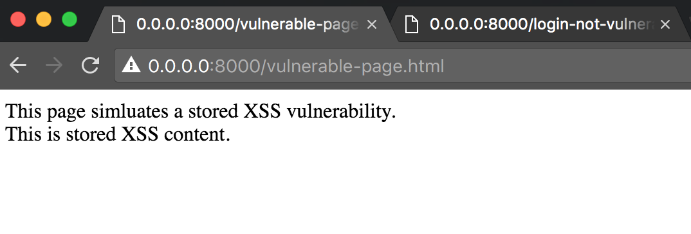
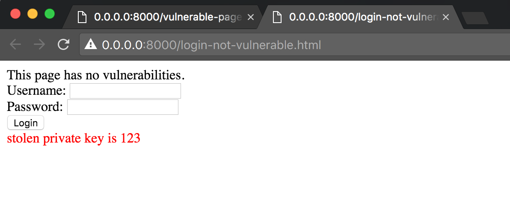
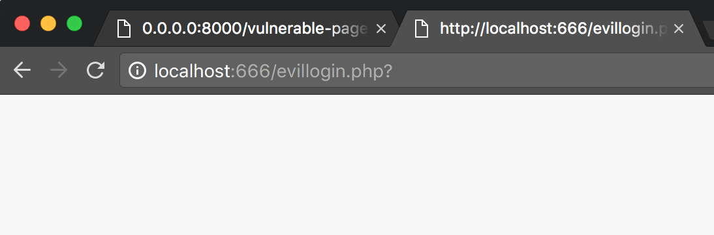

# Description

Demos a vulnerable page impacting the contents of a non-vulnerable page on the same domain.

##Usage

1. Execute:

    python simple-unsafe-inline-server.py

2. Browse to: http://0.0.0.0:8000/vulnerable-page.html

## Results

